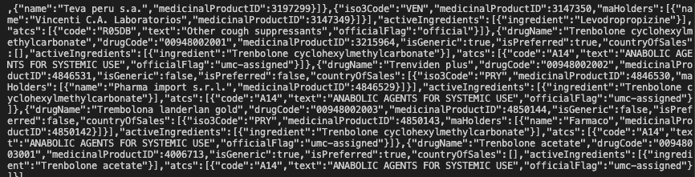

# Cliente whodrug Javascript

## Requerimientos

*   node 18
*   credeciales para el consumo del API de WhoDrug
    *   UMC\_CLIENT\_KEY= \[valor\]
    *   UMC\_LICENSE\_KEY= \[valo\]

## Ejecución

1.  Mediante una interfaz de consola.
2.  Nos ubicamos en el directorio 'cliente\_javascript'.
3.  Ejecutamos el comando.

```
  node main.js
```

## Salida

En consola se presentará una salida similar a la siguiente  
